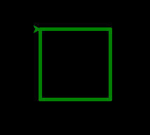
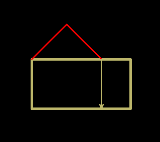

Deze keer gaan we tekenen met Python Turtle.

<!--more-->

# Turtle introductie

## Commando's

### Python Interpreter

Start Thonny.

Type onderin (je hoeft de >>> niet te typen):

    >>> from turtle import *

Hiermee geef je Python de opdracht om de turtle te gebruiken.

### Tekenen

Je turtle kan voor je tekenen door hem opdrachten te geven. Type het volgende:

    >>> forward(100)

Met dit commando gaat je turtle 100 stapjes vooruit. Als dat nog niet gebeurd
was, moet nu een scherm zijn geopend, waarin je de de turtle en een lijn kan
zien.

De turtle kan ook achteruit:

    >>> backward(100)

### Dikkere lijnen

Je kan je lijnen dikker maken met width(). Probeer deze commando's maar eens
uit:

    >>> width(5)
    >>> forward(100)
    >>> width(2)
    >>> forward(100)
    >>> width(1)
    >>> forward(100)

Tip: met de pijltjestoetsen (omhoog en omlaag) op je toetsenbord kun je eerdere commando's terug
halen. Met enter kun je die dan opnieuw uitvoeren.

### Draaien

Je kan je turtle laten draaien:

    >>> right(90)

Hiermee draait de turtle 90 graden naar rechts. Als je niet weet wat 90 graden
betekent, kun je verschillende getallen uitproberen. Je kan ook naar links
draaien. Probeer deze commando's maar eens uit:

    >>> left(45)
    >>> forward(100)
    >>> right(180)
    >>> forward(100)
    >>> left(360)
    >>> forward(100)

### Kleur

Je turtle en de lijnen zijn nu nog zwart. Je kan de kleur van de turtle en de
achtergrond kleur makkelijk veranderen. Probeer deze commando's eens uit en
kijk bij elk commando wat er verandert op je scherm:

    >>> color('green')
    >>> forward(100)
    >>> bgcolor('yellow')
    >>> color('red')
    >>> forward(100)

Experimenteer vooral ook met andere kleuren! Onderin deze pagina zie je een
overzichtje van allerlei verschillende kleuren.

### Opnieuw beginnen

Je kan de tekening die de turtle heeft gemaakt verwijderen:

    >>> clear()

Je kan ook helemaal opnieuw beginnen:

    >>> reset()
    >>> bgcolor('white')

## Opdrachten

Probeer de onderstaande plaatjes eens na te tekenen met je turtle. Gebruik na
elke opdracht het reset() commando om aan de volgende te beginnen. De achtergrondkleur
staat telkens ingesteld op 'black'.

### Opdracht 1-A

*kleur: 'green'*

### Opdracht 1-B

*kleuren: 'lightblue' en 'yellow'*

### Opdracht 1-C

*kleuren: 'darkkhaki' en 'red'.*

## Kleuren overzicht

Hier zijn verschillende kleuren die je kan gebruiken voor color() of bgcolor().

# Python introductie

## Variabelen en loops

### Variabelen

Probeer deze code eens uit en kijk goed wat er gebeurt:

    >>> getal = 45
    >>> forward(getal)
    >>> right(getal)
    >>> forward(getal)
    >>> getal = 90
    >>> right(getal)
    >>> forward(getal)

Het woord "getal" is hier een variabele. Een variabele heeft een naam die je
zelf kiest en een waarde. Die waarde begint hier als 45 en wordt later
ingesteld als 90.

Je kan Python ook rekensommetjes laten maken en de uitkomst in een variabele
stoppen. Om te weten wat voor waarde een variabele heeft, type je de naam van de
variabele in en druk je op enter. Probeer maar eens uit:

    >>> getal1 = 1 + 1
    >>> getal1
    2
    >>> getal2 = 9 - getal1
    >>> getal2
    7
    >>> getal3 = getal2 * 2
    >>> getal3
    14
    >>> getal4 = 28 / getal3
    >>> getal4
    2.0

Zoals je ziet: '*' betekent vermenigvuldigen, en '/' is delen door.

### Herhaling

Je kan bepaalde commando's ook meerdere keren laten uitvoeren, dat noemen we
een loop:

    >>> for teller in range(4):
    ...     forward(100)
    ...     right(90)

*Let op:* Nadat je dit getypt hebt moet je nog een keer op enter drukken,
zodat Python weet dat je klaar bent met je loop.

In dit voorbeeld is "teller"
een variabele die optelt en range() geeft aan tot welk getal geteld moet
worden. Teller begint bij 0 en telt tot 4. Als je nu de waarde van teller
vraagt, zie je dat het tellen is opgehouden voordat 4 werd bereikt:

    >>> teller
    3

Je kan teller dus ook gebruiken in je turtle opdrachten! Kun jij voorspellen
wat er gebeurt als je onderstaande commando's intypt?

    >>> for teller in range(1,5):
    ...     forward(50 * teller)
    ...     right(90)

Met *range(1,5)* begint het tellen bij 1 en eindigt op 4 (voordat de 5 wordt
bereikt).

## Figuren tekenen

### Veelhoek

Met een klein rekensommetje kun je ook een veelhoek tekenen! Om een veelhoek te
tekenen moet je weten wat voor hoek je turtle moet maken. Gelukkig kan Python
dat voor je berekenen: om de turtle helemaal rond te laten gaan moet deze 360
graden gedraaid zijn.

    >>> aantal_punten = 5
    >>> hoek = 360 / aantal_punten
    >>> for teller in range(aantal_punten):
    ...     forward(100)
    ...     right(hoek)

Wat gebeurt er nu als je de variabele aantal_punten een hoger getal geeft?

### Ster

De hoek die je nodig hebt voor een ster is moeilijker te berekenen. Sommige
sterren zijn niet eens in 1 lijn te tekenen, bijvoorbeeld de 6-puntige ster. De
5-puntige ster is makkelijker:

    >>> hoek = 144
    >>> for teller in range(5):
    ...     forward(100)
    ...     right(hoek)

## Opdrachten

Probeer de onderstaande figuren te tekenen.

### Opdracht 2-A

*Tip:* De hoek is 150 graden.

### Opdracht 2-B

*Uitdaging:* probeer zo min mogelijk commando's te gebruiken om de opdracht uit te voeren. Lukt het in 5
regels? Vraag een mentor om tips!

### Opdracht 2-C

*Tip:* Gebruik een zo klein mogelijke waarde in je forward() zodat de cirkel
niet te groot wordt!

# Turtle voor gevorderden

## Meer turtle commando's

### Vormen en stempels

Je turtle lijkt tot nu toe niet echt op een schildpad, maar dat kun je
veranderen:

    >>> shape('turtle')
    >>> color('darkgreen')

Met shape() kun je dus de vorm veranderen. Andere vormen zijn “arrow”,
“circle”, “square”, “triangle” en “classic”.

Je turtle kan ook stempelen, net als in Scratch. Probeer deze commando's eens
uit en kijk na elke stap wat er gebeurt:

    >>> shape('circle')
    >>> color('red')
    >>> stempel1 = stamp()
    >>> right(90)
    >>> forward(50)
    >>> shape('square')
    >>> color('yellow')
    >>> stempel2 = stamp()∏
    >>> forward(50)
    >>> shape('triangle')
    >>> color('blue')
    >>> stempel3 = stamp()
    >>> forward(50)
    >>> shape('classic')
    >>> clearstamp(stempel2)

Elke keer dat we stempelen, met stamp(), maken we ook een variabele aan. Die
variabelen kunnen we gebruiken om stempels die we gedrukt hebben te
verwijderen, met clearstamp(). Daarom is het handig om ze een naam te geven
zoals stempel1, stempel2, etc. Dan weet je later nog precies welke stempel dat
is geweest.

### Turtle posities

Tot nu toe hebben we de turtle verplaatst door vooruit/achteruit te gaan en te
draaien, maar je kan ook de turtle opdracht geven om naar een bepaalde plek te
gaan:

    >>> setpos(50,50)
    >>> setpos(-25,75)
    >>> setpos(0,0)

Om erachter te komen wat elk getal betekent, kun je het beste 1 van de 2
veranderen en dan zien wat er gebeurt. Het eerste getal noemen we de X-as, het
tweede getal noemen we de Y-as.

Soms wil je de turtle verplaatsen zonder dat er een lijn wordt getekend. Je
turtle kan zijn pen optillen en neerzetten met penup() en pendown(). Om
bijvoorbeeld een vork te tekenen, schrijf je dit:

    >>> left(90)
    >>> backward(100)
    >>> forward(125)
    >>> setpos(0,0)
    >>> left(90)
    >>> forward(25)
    >>> right(90)
    >>> forward(25)
    >>> penup()
    >>> setpos(0,0)
    >>> pendown()
    >>> right(90)
    >>> forward(25)
    >>> left(90)
    >>> forward(25)
    >>> penup()
    >>> setpos(0,0)

Je kan aan je turtle vragen wat zijn X positie is en wat zijn Y positie is. Je
kan die positie ook opslaan in variabelen, zodat je ze later kan gebruiken:

    >>> left(30)
    >>> forward(100)
    >>> xcor()
    86.60254037844388
    >>> ycor()
    49.99999999999999
    >>> x = xcor()
    >>> setpos(x, 0)
    >>> setpos(0, 0)

### Inkleuren

Je turtle tekent mooie lijnen, maar je vormen kunnen ook ingekleurd worden:

    >>> bgcolor('black')
    >>> color('green')
    >>> fillcolor('darkgreen')
    >>> width(3)
    >>> begin_fill()
    >>> for x in range(4):
    ...     forward(100)
    ...     right(90)
    ...
    >>> end_fill()

Let op dat het invullen pas gebeurt bij end_fill(). Je kan de invulkleur kiezen
met fillcolor(). Als je geen invulkleur kiest, wordt de kleur van je pen
gebruikt.

Deze techniek wordt echt indrukwekkend als je het gebruikt bij meer
ingewikkelde tekeningen. Met deze code teken je bijvoorbeeld een mooie
geel-zwarte ster:

    >>> color('yellow')
    >>> bgcolor('black')
    >>> begin_fill()
    >>> for x in range(18):
    ...     forward(200)
    ...     left(100)
    ...
    >>> end_fill()

### Tekst en turtle verbergen

De laatste twee technieken die we hier behandelen spreken bijna voor zich.
Probeer de onderstaande code maar eens om een deurmat te tekenen. Welke
commando's ken je nog niet? Snap je waar ze voor bedoeld zijn?

    >>> write('Welkom!')
    >>> penup()
    >>> setpos(-20,20)
    >>> pendown()
    >>> for x in range(2):
    ...     forward(70)
    ...     right(90)
    ...     forward(40)
    ...     right(90)
    ...
    >>> hideturtle()

*Tip:* hideturtle() is ook een handig commando bij het stempelen. Om de turtle
weer te tonen gebruik je showturtle().

## Opdrachten

Probeer de onderstaande tekeningen na te maken, of bedenk je eigen tekeningen.

### Opdracht 3-A

*Schildpadden in een zandbak*

### Opdracht 3-B

TODO: een klok, een ruiten 3 speelkaart.

## Antwoorden



Let op: de volgende lijn ontbreekt aan de bovenkant van deze voorbeelduitwerkingen:



    from turtle import *
    


<h2>Deel 1</h2>

<h3>Opdracht 1-A</h3>



    bgcolor('black')
    color('green')
    width(5)
    forward(100)
    right(90)
    forward(100)
    right(90)
    forward(100)
    right(90)
    forward(100)
    right(90)


    
<h3>Opdracht 1-B</h3>



    bgcolor('black')
    color('yellow')
    width(3)
    left(90)
    
    forward(50)
    right(90)
    forward(200)
    right(90)
    forward(100)
    right(90)
    forward(200)
    right(90)
    forward(50)
    
    color('lightblue')
    width(1)
    right(45)
    forward(100)
    right(90)
    forward(100)
    right(90)
    forward(100)
    right(90)
    forward(100)


    
<h3>Opdracht 1-C</h3>



    bgcolor('black')
    color('darkkhaki')
    width(5)
    forward(200)
    right(90)
    forward(100)
    right(90)
    forward(200)
    right(90)
    forward(100)
    
    color('red')
    width(2)
    right(45)
    forward(100)
    right(90)
    forward(100)
    
    color('darkkhaki')
    right(45)
    forward(100)


    
<h2>Deel 2</h2>

<h3>Opdracht 2-A</h3>

Tip: 12 x 150 = 1800, en 1800 / 360 = 5. 
Omdat 1800 deelbaar is door 360, komen de hoeken precies goed uit voor een ster.



    bgcolor('black')
    color('lightblue')
    width(3)
    
    for i in range(12):
        forward(100)
        right(150)


        
<h3>Opdracht 2-B</h3>



    bgcolor('black')
    color('lightblue')
    width(3)
    for i in range(4):
        for j in range(3):
            forward(100)
            right(120)
        right(90)


        
<h3>Opdracht 2-C</h3>

Tip: In plaats van 360 en 1 kan je ook andere getallen kiezen.
Zorg dat deze keer elkaar 360 zijn.



    bgcolor('black')
    color('lightblue')
    width(3)
    for i in range(360):
        forward(2)
        right(1)


        
<h2>Deel 3</h2>

<h3>Opdracht 3-A</h3>

In deze voorbeelduitwerking staan 2 stempels.
Je kan er zelf nog een paar toevoegen als je wil!



    bgcolor('black')
    color('yellow')
    width(5)
    fillcolor('lightyellow')
    begin_fill()
    setpos(0,200)
    setpos(200,200)
    setpos(200,0)
    setpos(0,0)
    end_fill()
    
    penup()

    setpos(50,50)
    shape('turtle')
    color('green')
    stempel1 = stamp()
    
    setpos(84,129)
    right(120)
    shape('turtle')
    color('blue')
    stempel2 = stamp()
    




