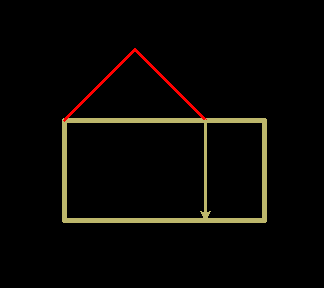

Turtle introductie
==================

Commando's
----------

**Python Interpreter**

Start Thonny.
Type onderin (je hoeft de >>> niet te typen):

    >>> from turtle import *

Hiermee geef je Python de opdracht om de turtle te gebruiken.

**Tekenen**

Je turtle kan voor je tekenen door hem opdrachten te geven. Type het volgende:

    >>> forward(100)

Met dit commando gaat je turtle 100 stapjes vooruit. Als dat nog niet gebeurd
was, moet nu een scherm zijn geopend, waarin je de de turtle en een lijn kan
zien.

De turtle kan ook achteruit:

    >>> backward(100)

**Dikkere lijnen**

Je kan je lijnen dikker maken met width(). Probeer deze commando's maar eens
uit:

    >>> width(5)
    >>> forward(100)
    >>> width(2)
    >>> forward(100)
    >>> width(1)
    >>> forward(100)

Tip: met de pijltjestoetsen (omhoog en omlaag) op je toetsenbord kun je eerdere commando's terug
halen. Met enter kun je die dan opnieuw uitvoeren.

**Draaien**

Je kan je turtle laten draaien:

    >>> right(90)

Hiermee draait de turtle 90 graden naar rechts. Als je niet weet wat 90 graden
betekent, kun je verschillende getallen uitproberen. Je kan ook naar links
draaien. Probeer deze commando's maar eens uit:

    >>> left(45)
    >>> forward(100)
    >>> right(180)
    >>> forward(100)
    >>> left(360)
    >>> forward(100)

**Kleur**

Je turtle en de lijnen zijn nu nog zwart. Je kan de kleur van de turtle en de
achtergrond kleur makkelijk veranderen. Probeer deze commando's eens uit en
kijk bij elk commando wat er verandert op je scherm:

    >>> color('green')
    >>> forward(100)
    >>> bgcolor('yellow')
    >>> color('red')
    >>> forward(100)

Experimenteer vooral ook met andere kleuren! Onderin deze pagina zie je een
overzichtje van allerlei verschillende kleuren.

**Opnieuw beginnen**

Je kan de tekening die de turtle heeft gemaakt verwijderen:

    >>> clear()

Je kan ook helemaal opnieuw beginnen:

    >>> reset()
    >>> bgcolor('white')

Opdrachten
----------
Probeer de onderstaande plaatjes eens na te tekenen met je turtle. Gebruik na
elke opdracht het reset() commando om aan de volgende te beginnen. De achtergrondkleur
staat telkens ingesteld op 'black'.

**Opdracht 1-A**

.. image:: images/o1a.png

*kleur: 'green'*

**Opdracht 1-B**

.. image:: images/o1b.png

*kleuren: 'lightblue' en 'yellow'*

**Opdracht 1-C**

*kleuren: 'darkkhaki' en 'red'.*

Kleuren overzicht
-----------------

Hier zijn verschillende kleuren die je kan gebruiken voor color() of bgcolor().

.. image:: images/colors.jpg
